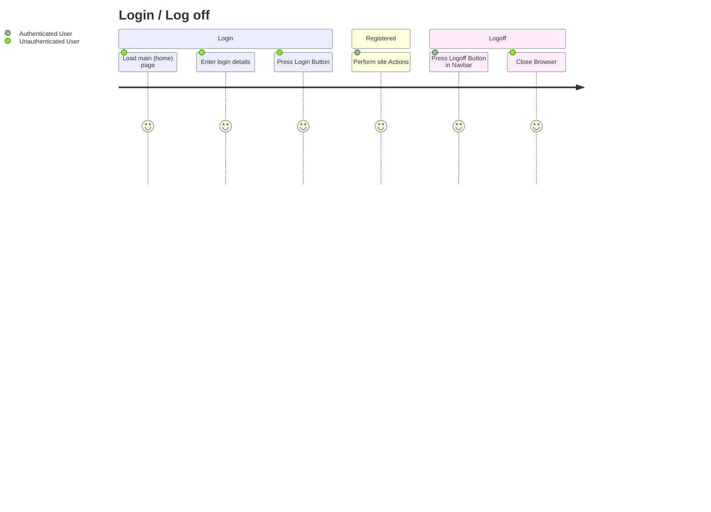
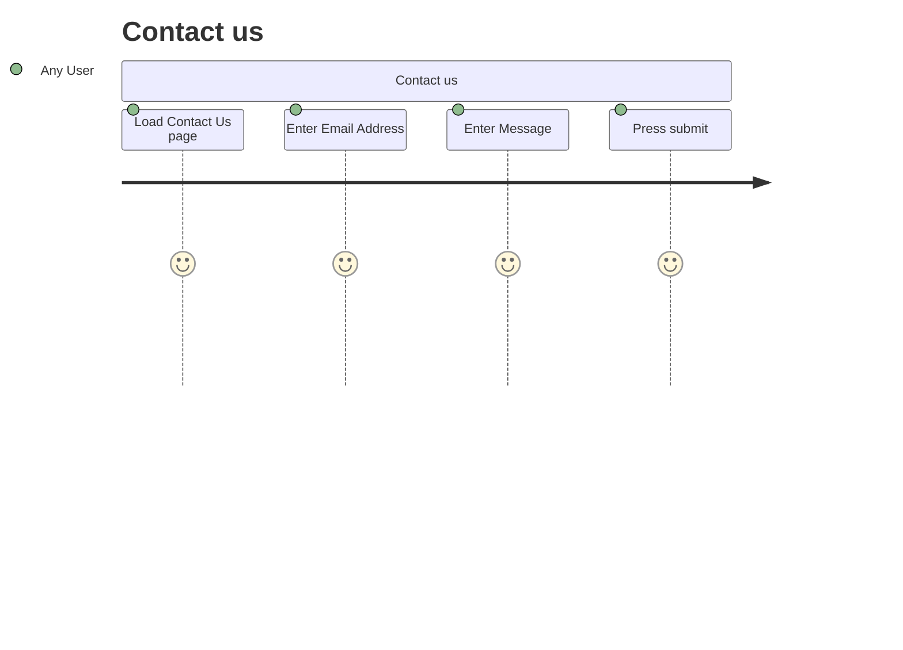

# Project Overview

This PHP website will be an ecommerce site to sell yu-gi-oh cards.
## User Management
Users will be able to log in, log out,reset their passwords, and edit their details.

Users will need to store

- Name
- DOB
- Hashed password
- Access Level (User vs Administrator)
- Status (active or disabled)
- Cart Items
- Purchase History (clickable hyperlink to product/s)
## Product Management
Administrators will be able to add, remove, or edit products.

Products will have

- A Name
- A Price
- A Description
- Quantity
- Current Product Stock

# Behaviour - User Journey

- invoice
- ordering
- Admin Product Add
- Admin Product Edit
- Admin Product Remove

# Planning Diagram - WireFrames

