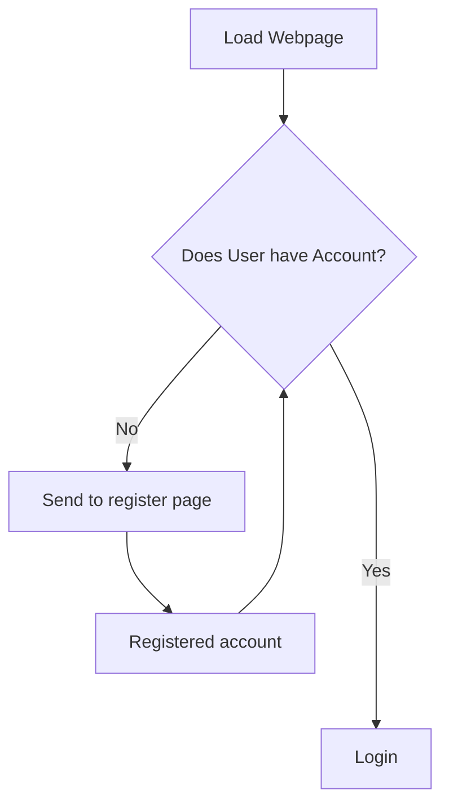
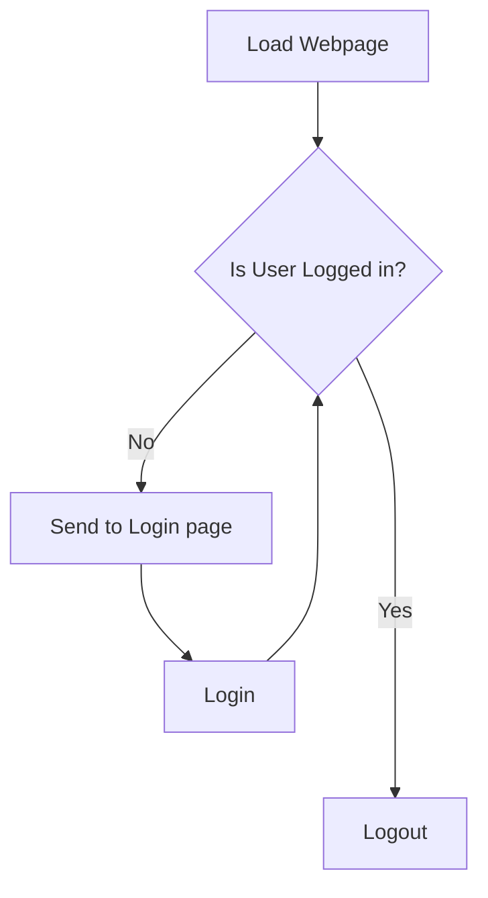
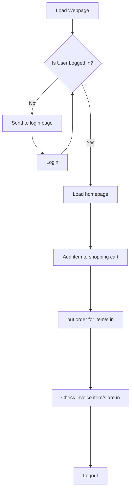
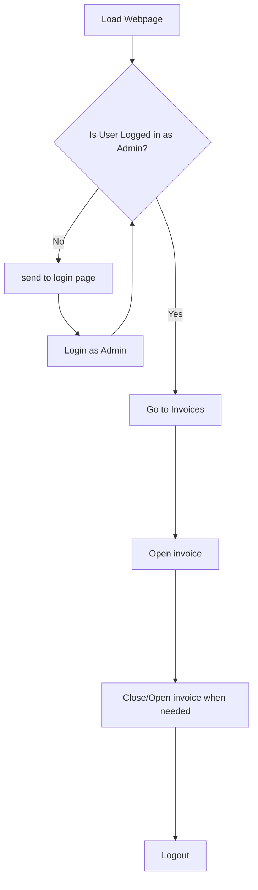

```mermaid
flowchart TD
    A[Load Webpage] --> B{Does User have Account?}
    B -->|No| C[Send to register page]
    C --> D[Registered account]
    D --> B
    B ---->|Yes| E[Login]
```

```mermaid
flowchart TD
    A[Load Webpage] --> B{Is User Logged in?}
    B -->|No| C[Send to Login page]
    C --> D[Login]
    D --> B
    B ---->|Yes| E[Logout]
```

```mermaid
flowchart TD
    A[Load Webpage] --> B{Is User Logged in?}
    B -->|No| C[Send to login page]
    C --> D[Login]
    D --> B
    B ---->|Yes| E[Load homepage]
    E ----> F[Add item to shopping cart]
    F ----> G[put order for item/s in]
    G----->H[Check invoice item/s are in]
    H----->I[Logout]
```

```mermaid
flowchart TD
    A[Load Webpage] --> B{Is User Logged in as Admin?}
    B -->|No| C[send to login page]
    C --> D[Login as Admin]
    D --> B
    B ---->|Yes| E[Go to Invoices]
    E-----> F[Open invoice]
    F----->G[Close/Open invoice when needed]
    G----->H[Logout]
```